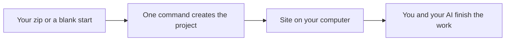

# WordPress Agency Kit

<p align="center">
  <a href="https://amansarraf.github.io/wordpress-agency-kit/"><strong>Documentation site</strong></a>
  ·
  <a href="https://github.com/AmanSarraf/wordpress-agency-kit">GitHub</a>
</p>

<p align="center">
  
</p>
<p align="center"><sub>Photo: <a href="https://unsplash.com/photos/cGwfkwHdeLs">Christopher Gower</a> on <a href="https://unsplash.com">Unsplash</a></sub></p>

<p align="center">
  <strong>Your AI teammate for everyday WordPress work.</strong><br>
  Drop in a design or an existing site. Get a local preview. Keep going with the coding agent you already use.
</p>

<p align="center">
  <a href="#start-in-5-minutes">Get started</a> ·
  <a href="#open-it-in-your-coding-agent">Codex, Claude, Cursor, Grok</a> ·
  <a href="#what-you-can-ask">What to say</a>
</p>

---

If you build WordPress sites for clients — and you want AI to handle the boring parts — this kit is for you.

Clone it. Open the folder in **Codex CLI**, Claude Code, Cursor, Grok, Copilot, or any similar tool. The agent already knows how you like to work.

---

## How it feels

Bring a zip → see it on your computer → keep building with AI.



You might start with:

- a pretty **HTML/CSS** template you bought
- a **copy of a live WordPress site**
- or **nothing** — a fresh local WordPress

The kit keeps each client in its own folder, so you can run more than one site without mixing them up.

---

## Start in 5 minutes

**1. Copy the kit**

```bash
git clone https://github.com/AmanSarraf/wordpress-agency-kit.git
cd wordpress-agency-kit
```

**2. Check your computer**

```bash
./bin/wp-agency doctor
```

If something is missing (often Docker), it tells you what to install — in plain language. Fix those, then run `doctor` again until it says you’re ready.

**3. Start a site**

```bash
./bin/wp-agency new my-shop --from empty
cd ../client-projects/my-shop
docker compose up -d
```

Open [http://localhost:8080](http://localhost:8080) and finish the WordPress welcome screens.

That’s it. Your “install” is: **clone + open this folder in your agent.**

---

## Open it in your coding agent

Treat this folder the way you’d add a skill pack: **the project is the skill.**

| You use | Do this |
|---|---|
| **Codex CLI** | `cd wordpress-agency-kit` then `codex` |
| **Claude Code** | `cd wordpress-agency-kit` then `claude` |
| **Grok** | Open this folder as the workspace |
| **Cursor** | File → Open Folder → `wordpress-agency-kit` |
| **GitHub Copilot / others** | Open this folder; they pick up `AGENTS.md` |

Then say something simple:

> Get my machine ready, then start a new client called sunrise-cafe.

or

> I have a ThemeForest zip on my Desktop. Turn it into a WordPress theme.

The file `AGENTS.md` is the playbook. You don’t have to memorize it.

More detail: [docs/install-agents.md](docs/install-agents.md)

---

## What you can ask

| You have | You run | Then tell the agent |
|---|---|---|
| Nothing yet | `./bin/wp-agency new cafe --from empty` | “Walk me through the local site.” |
| An HTML template zip | `./bin/wp-agency new cafe --from html --zip ~/Downloads/theme.zip` | “Turn this template into a WordPress theme.” |
| A copy of a live WordPress site | `./bin/wp-agency new cafe --from wp-zip --zip ~/Downloads/site.zip` | “Get this dump running locally.” |

Handy extras:

```bash
./bin/wp-agency ports          # which local sites are using which ports
./bin/wp-agency help
```

Guides: [HTML template](docs/workflow-html-template.md) · [Existing WordPress zip](docs/workflow-wp-zip.md) · [Where files live](docs/project-layout.md)

---

## Everyday help

Once a project is open, your agent can help you:

- match a design to a real WordPress theme
- add pages, menus, and shop-style content
- keep several client sites on one computer
- prepare a site to go live
- write a short handover for the client

You stay in charge. The kit just makes the first hour — and the next ten — less messy.

---

## Several clients at once

Each new site gets its own folder and its own local address (8080, then 8082, and so on).

```text
wordpress-agency-kit/          ← you cloned this
../client-projects/
    my-shop/
    sunrise-cafe/
```

Want a different place for clients? Set `WP_AGENCY_CLIENTS_DIR`.

---

## If you’re missing Docker

`./bin/wp-agency doctor` will say so.

- **Mac:** [Docker Desktop for Mac](https://docs.docker.com/desktop/setup/install/mac-install/) (or `brew install --cask docker`)
- **Windows:** [Docker Desktop for Windows](https://docs.docker.com/desktop/setup/install/windows-install/)
- **Linux:** [Docker Engine](https://docs.docker.com/engine/install/)

Start Docker, then run `doctor` again.

---

## License

MIT. Use it on client work, fork it, share it with a friend.

---

<p align="center">Made for people who ship WordPress sites — with a little help from AI.</p>
